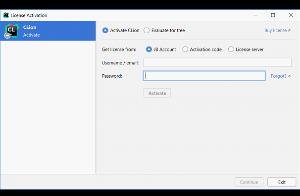
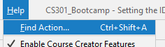
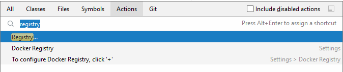

# Before you start

It would be helpful to make sure you have 
a [GitHub account](https://github.com/signup) already created.

You can use either a personal or school email address with your GitHub account.

# CLion

CLion is a **I**ntegrated **D**evelopment **E**nvironment (IDE) created by the 
company JetBrains.  

This is a short guide how to get the free education license for CLion and 
install it on your machine. 

### Educator License
* Start by applying for a license by filling out their application.

    https://www.jetbrains.com/community/education/#students
* After you apply, you will get an email with a confirmation link you will
  need to click.

  

  

### Install and Set up CLion

* Once you have been approved, you can log in using the JB account you created.

    

* When you first open CLion, you should have this welcome window. From here 
you can add your GitHub using **"Get from VCS"**.

* From here, you can add your GitHub credentials:

    

    

    

# Configuring the Compiler

Next you will need to configure your compiler.

* [Windows Instructions](2%20-%20Compiler Setup%20(Windows).md)
* [MacOS Instructions](2%20-%20Compiler%20Setup%20(MacOS).md)

# Windows Only (Optional)

There is a small issue with printing where an extra space is printed the 
first instance you call cout.  This can be fixed using the following steps.

### Help &rarr; Find Action

### Search for Registry

### Select run.processess.with.pty

