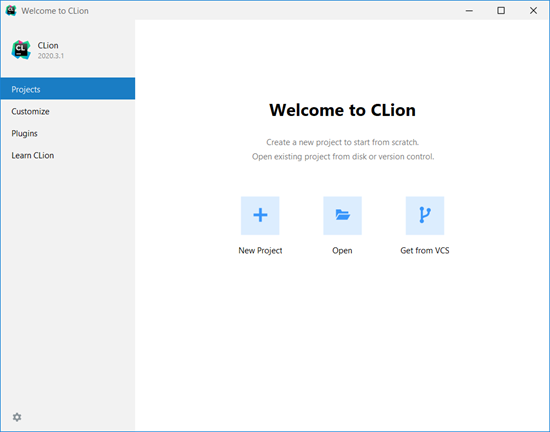

# Clone Bootcamp Material

After you configure your compiler for CLion, you will "clone" the bootcamp material from GitHub to your machine.

### Create a copy of the bootcamp repository

* Navigate to the
  [bootcamp repository](https://github.com/DrErickson/CS301_Bootcamp_Topics).

* After that click on **"Use this template" &rarr; "Create a new repository"**

  

* Give your repository a name.
* Mark your repository public or private based on
  your preference.  Private means other people will not be able to find or
  view your repository.  Public will allow others to find and view your
  repository.
* Click **"Create repository from template"**

  

### Clone material to local machine

* Click "Get from VCS"

  

  Alternatively, you can also click **"File" &rarr; "New" &rarr; "Project from
  Version Control"**

  
* From here you should be able to see all of your GitHub projects.  Click
  **Clone**.

  

* Click **"Ok"** after you see the following settings wizard prompt

  
